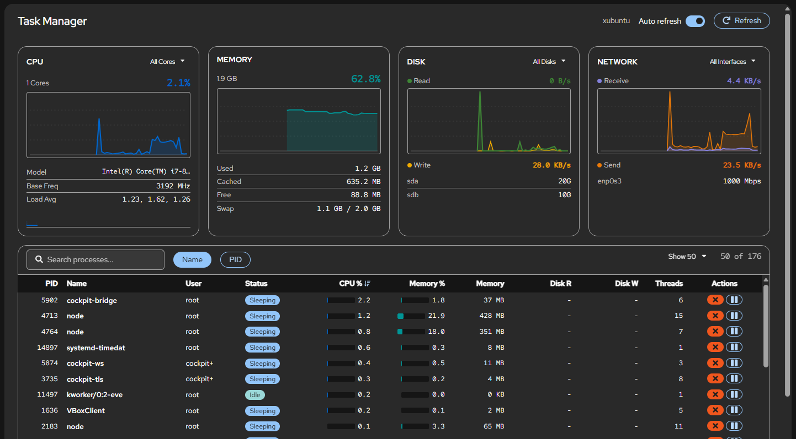

# Cockpit Task Manager

A real-time, Task Manager–style system monitor plugin for the [Cockpit](https://cockpit-project.org/) web console. It provides a single-page view of system resource usage and running processes, giving Linux administrators an intuitive way to monitor and manage their servers directly from the browser.

Built on top of the [Cockpit Starter Kit](https://github.com/cockpit-project/starter-kit).


## Features

- **System Overview Dashboard** — Live cards for CPU, Memory, Disk I/O, Network, and GPU (when available) with rolling 60-point SVG graphs updated every 2 seconds.
- **Per-Core CPU Monitoring** — Dropdown to view individual core utilization graphs, plus color-coded (blue / yellow / red) per-core bar chart for up to 32 cores.
- **Per-Disk I/O Breakdown** — Dropdown selector to view aggregate or individual disk read/write rates.
- **Per-Interface Network Stats** — Dropdown selector to view aggregate or per-interface send/receive rates.
- **GPU Monitoring** — Auto-detects NVIDIA (via nvidia-smi) and AMD (via sysfs) GPUs. Shows utilization graph, VRAM usage, temperature, and power draw.
- **Process Table** — Sortable, searchable table with columns for PID, Name, User, Status, CPU %, Memory %, RSS, Disk R/W, and Threads.
- **Per-Process Disk I/O** — Reads `/proc/[pid]/io` to show per-process disk read/write rates in the process table.
- **Process Management** — End, pause, and resume processes with configurable signal selection (SIGTERM, SIGKILL, SIGHUP, SIGINT, SIGQUIT) via a confirmation dialog.
- **Auto-Refresh** — 2-second polling interval (togglable), with a manual refresh button.
- **Hardware Info** — Displays CPU model & frequency, disk device sizes, network interface link speeds, and GPU model.
- **Dark Theme** — Full support for Cockpit's dark theme.
- **Internationalization** — All UI strings are translatable via `cockpit.gettext()`.

## Screenshot



## How It Works

The plugin reads system statistics directly from `/proc/stat`, `/proc/meminfo`, `/proc/diskstats`, `/proc/net/dev`, and other proc files using the Cockpit JS API. Process information is gathered via `ps` and process signals are sent via `kill`, both through `cockpit.spawn()`. No additional agents or daemons are required — everything runs through the standard Cockpit bridge.

## Getting and Building the Source

### Dependencies

On Debian/Ubuntu:

    sudo apt install gettext nodejs npm make

On Fedora:

    sudo dnf install gettext nodejs npm make

On openSUSE:

    sudo zypper in gettext-runtime nodejs npm make

### Building

```sh
git clone https://github.com/ArindamSharma/cockpit-task-manager.git
cd cockpit-task-manager
make
```

This builds the plugin into the `dist/` directory.

### Installing for Development

Link your checkout so Cockpit picks it up locally:

```sh
make devel-install
```

Or manually:

```sh
mkdir -p ~/.local/share/cockpit
ln -s $(pwd)/dist ~/.local/share/cockpit/task-manager
```

After changing code, run `make` again and reload the Cockpit page.

### Undo Installation for Development

Un-Link your checkout from Cockpit :

```sh
make devel-uninstall
```

Or manually:

```sh
rm -f ~/.local/share/cockpit/starter-kit
```


### Watch Mode

Auto-rebuild on every file change:

    make watch

To auto-upload to a remote VM:

    RSYNC=myhost make watch

### Production Build

    NODE_ENV=production make

### Installing System-Wide

    sudo make install

This installs to `/usr/local/share/cockpit/`.

## Releasing / Building Packages

The project includes Makefile targets for building distribution packages.
All targets build the project in production mode automatically.

### Prerequisites

Ensure the following are installed before building:

On **Debian / Ubuntu**:

```sh
sudo apt install gettext nodejs npm make dpkg-deb
```

On **Fedora / RHEL / CentOS**:

```sh
sudo dnf install gettext nodejs npm make rpm-build
```

On **Arch Linux**:

```sh
sudo pacman -S gettext nodejs npm make base-devel
```

### Debian / Ubuntu (.deb)

```sh
make deb
```

Produces `cockpit-task-manager_<version>_all.deb` in the project root.

### Fedora / RHEL / CentOS (.rpm)

```sh
make rpm
```

Produces `cockpit-task-manager-<version>.rpm` in the project root.

### Source RPM (.src.rpm)

A source RPM bundles the source tarball, the node dependency cache, and the
spec file so that the package can be rebuilt in a clean build environment
(e.g. mock, koji, COPR):

```sh
make srpm
```

### Arch Linux (PKGBUILD)

A `PKGBUILD` is generated during `make dist`. Build with:

```sh
make dist
cd packaging/arch
makepkg
```

### Source Tarball

```sh
make dist
```

Produces `cockpit-task-manager-<version>.tar.xz` — suitable for uploading to
a GitHub release or feeding into downstream package builds.

## License

LGPL-2.1-or-later
